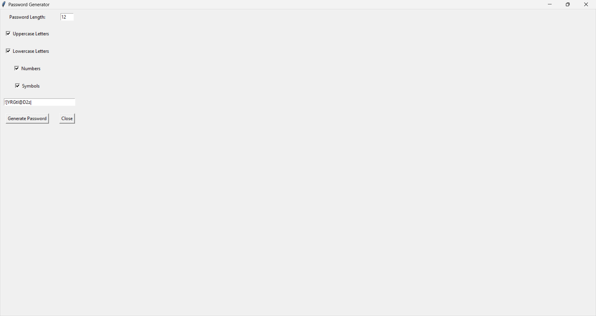
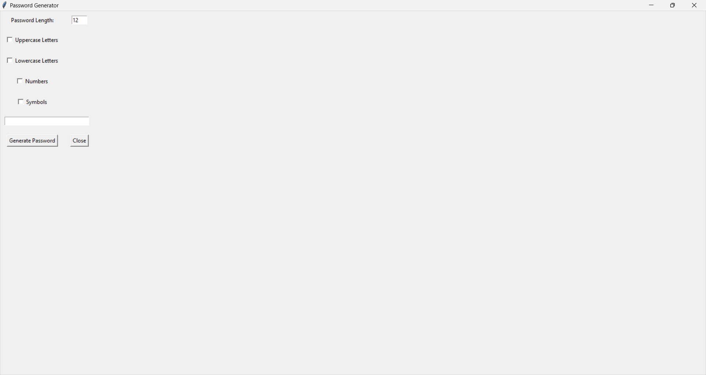

# Password Generator

This is a simple password generator application created using Python with a Graphical User Interface (GUI) built with Tkinter.

## Table of Contents

- [Features](#features)
- [Installation](#installation)
- [Usage](#usage)
- [Screenshots](#screenshots)
- [Contributing](#contributing)
- [License](#license)

## Features

- Generates random passwords based on user preferences.
- Allows users to specify password length and character types (uppercase, lowercase, numbers, symbols).
- Provides a user-friendly interface for generating passwords.

## Installation

1. Clone the repository:

    ```bash
    git clone https://github.com/yourusername/password-generator.git
    ```

2. Navigate to the project directory:

    ```bash
    cd password-generator
    ```

3. Install the required dependencies (if necessary). In this case, there are no external dependencies beyond Python standard library.

## Usage

1. Run the application:

    ```bash
    python password_generator.py
    ```

2. Specify the desired password length and select the character types you want to include in the password.

3. Click on the "Generate Password" button to generate a random password.

4. Optionally, click on the "Close" button to exit the application.

## Screenshots




Include screenshots of your application here to provide users with a visual representation of how the password generator works.

## Contributing

Pull requests are welcome. For major changes, please open an issue first to discuss what you would like to change.

## License

[MIT](LICENSE)
